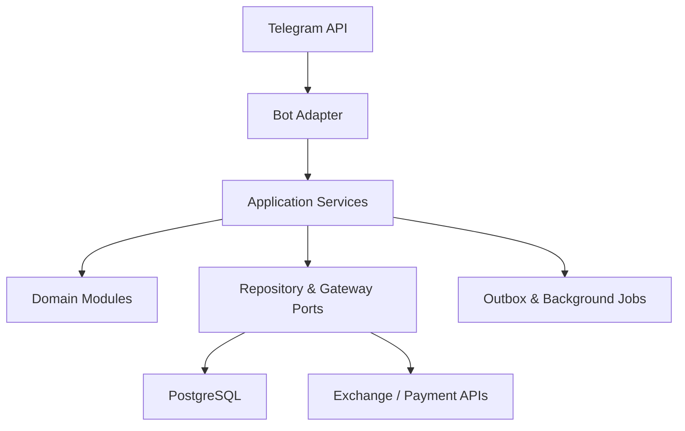
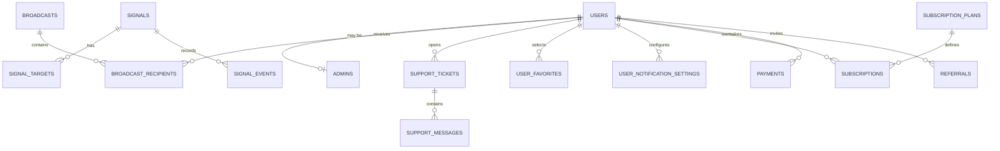
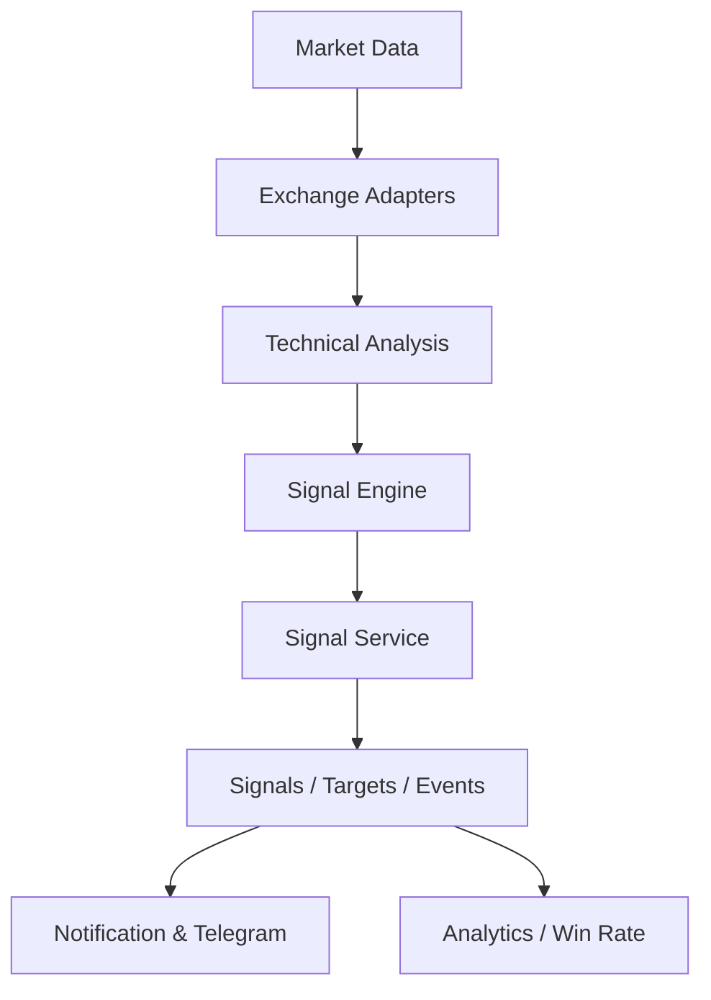

# معماری ربات حرفه‌ای سیگنال ارز دیجیتال

وضعیت سند: Phase 0 — تصویب معماری پیش از پیاده‌سازی\
تاریخ: 2026-08-31\
نسخه: 0.1.0

## 1. دامنه و مرز Phase 0

این سند معماری هدف، مرز ماژول‌ها، طراحی داده، وابستگی‌ها و مسیر توسعه آینده را مشخص می‌کند. در Phase 0 هیچ کد اجرایی، Docker configuration، مدل SQLAlchemy، migration یا قابلیت ربات ساخته نشده است.

وضعیت اولیه Repository: خالی.

## 2. تصمیم معماری اصلی

پروژه با معماری **Modular Monolith** و I/O کاملاً Async آغاز می‌شود. هر قابلیت یک ماژول دامنه مستقل دارد و وابستگی‌ها فقط از لایه بیرونی به درونی حرکت می‌کنند. این ساختار پیچیدگی عملیاتی MVP را پایین نگه می‌دارد و در عین حال امکان جداکردن Workerهای Broadcast، Notification و Market/Signal Engine را در آینده فراهم می‌کند.

### اصول الزام‌آور

- Handler فقط ورودی Telegram را اعتبارسنجی و خروجی را نمایش می‌دهد؛ Business Logic در Service قرار می‌گیرد.
- Service به Interfaceهای Repository و Gateway وابسته است، نه به SQLAlchemy یا Telegram API.
- Repository تنها مسئول persistence و query است و تصمیم تجاری نمی‌گیرد.
- مدل دامنه، مدل ORM و DTO ورودی/خروجی از هم تفکیک می‌شوند.
- همه timestampها در PostgreSQL به‌صورت `timestamptz` و با UTC ذخیره می‌شوند؛ تبدیل timezone فقط در presentation انجام می‌شود.
- شناسه Telegram با `bigint` ذخیره می‌شود و هیچ‌گاه به‌عنوان کلید داخلی همه روابط استفاده نمی‌شود.
- عملیات حساس چندجدولی داخل transaction انجام می‌شود.
- secrets فقط از environment خوانده می‌شوند و در log یا Repository ثبت نمی‌شوند.
- Callback data باید versioned، کوتاه، allow-listed و دارای کنترل authorization سمت سرور باشد.
- اضافه‌شدن Signal Engine نباید منطق فعلی ماژول‌های User/Admin/Support را تغییر دهد.

## 3. نمای سطح بالا



### جریان درخواست

1. Update از Telegram وارد Adapter می‌شود.
2. Middleware هویت، عضویت کانال، rate limit و authorization لازم را بررسی می‌کند.
3. Handler ورودی را به Command/DTO تبدیل می‌کند.
4. Application Service قوانین تجاری را اجرا می‌کند.
5. Repository تغییرات را در transaction ذخیره می‌کند.
6. رخدادهای قابل انتشار در Outbox ثبت می‌شوند و Worker آنها را با retry کنترل‌شده تحویل می‌دهد.

Outbox و Worker در Phase مربوط به Notification/Broadcast پیاده‌سازی می‌شوند، نه در Phase 0.

## 4. Technology Baseline

| بخش | انتخاب معماری | دلیل |
| --- | --- | --- |
| Runtime | Python 3.12 | پشتیبانی مناسب Async و type hints |
| Telegram | `python-telegram-bot` نسخه Async | سازگار با پروژه پیشین و lifecycle شفاف |
| Database | PostgreSQL 16+ | transaction، constraint، index و JSONB |
| ORM | SQLAlchemy 2.x Async | Data Mapper، transaction و تست‌پذیری |
| Driver | asyncpg | درایور Async PostgreSQL |
| Migration | Alembic | نسخه‌بندی قابل بازگشت Schema |
| Configuration | pydantic-settings | validation مرکزی environment |
| Tests | pytest + pytest-asyncio | Unit و Integration Async |
| HTTP integrations | httpx | Exchange و Payment adapters Async |
| Containers | Docker + Compose | محیط توسعه و production یکسان |
| Observability | logging ساختاریافته | trace و عملیات امن بدون secret |

نسخه‌های دقیق dependency در Phase 1 قفل می‌شوند.

## 5. ساختار هدف Repository

این ساختار نقشه هدف است و در Phase 0 ایجاد نمی‌شود:

```text
project/
├── app/
│   ├── main.py
│   ├── core/                 # config, logging, errors, security, lifecycle
│   ├── db/                   # engine, session, base, transaction boundary
│   ├── bot/                  # Telegram adapter
│   │   ├── handlers/
│   │   ├── middlewares/
│   │   ├── keyboards/
│   │   ├── states/
│   │   └── callbacks/
│   ├── modules/
│   │   ├── users/
│   │   ├── admins/
│   │   ├── channels/
│   │   ├── broadcasts/
│   │   ├── support/
│   │   ├── signals/
│   │   ├── analytics/
│   │   ├── favorites/
│   │   ├── notifications/
│   │   ├── subscriptions/
│   │   ├── payments/
│   │   └── referrals/
│   ├── integrations/        # Telegram, exchange, payment implementations
│   └── workers/             # background delivery and event consumers
├── migrations/
├── tests/
│   ├── unit/
│   ├── integration/
│   ├── security/
│   └── factories/
├── scripts/
├── docs/
└── deployment/
```

در هر ماژول دامنه، فایل‌های `entities`, `schemas`, `repository`, `service` و در صورت نیاز `errors` نگهداری می‌شوند. ORM modelها در مرز persistence قرار می‌گیرند.

## 6. مالکیت و وابستگی ماژول‌ها

| ماژول | مسئولیت | وابستگی مجاز |
| --- | --- | --- |
| `core` | config، logging، خطاهای پایه، clock و security primitives | کتابخانه استاندارد و config |
| `db` | engine، session، transaction و health | `core` |
| `bot` | handlers، keyboards، middleware و presentation | `core` و Service interfaces |
| `users` | ثبت، فعالیت و profile | `core`, repository port |
| `admins` | نقش مدیر و authorization | `users`, repository port |
| `channels` | کانال‌های اجباری و membership policy | Telegram membership gateway |
| `broadcasts` | campaign، recipient state و delivery report | `users`, Telegram gateway |
| `support` | ticket lifecycle و message routing | `users`, `admins` |
| `signals` | lifecycle سیگنال، target و event | repository port؛ مستقل از Telegram |
| `analytics` | win rate و aggregation | read interfaces از `signals` |
| `favorites` | علاقه‌مندی کاربر به symbol | `users` |
| `notifications` | preference، event routing و delivery | `users`, domain events |
| `subscriptions` | plan و entitlement | `users` |
| `payments` | payment state machine و gateway port | `subscriptions` |
| `referrals` | code، attribution و statistics | `users` |
| `integrations` | پیاده‌سازی APIهای بیرونی | portهای تعریف‌شده در ماژول‌ها |
| `workers` | اجرای jobهای idempotent و retry | application services |

### قواعد جلوگیری از coupling

- هیچ ماژول دامنه‌ای Handler ماژول دیگر را import نمی‌کند.
- `signals` به `analytics` و `notifications` وابسته نمی‌شود؛ domain event منتشر می‌کند.
- `payments` subscription را مستقیماً در callback خارجی فعال نمی‌کند؛ webhook معتبر، transaction و event استفاده می‌شود.
- `analytics` فقط read-model/query دارد و state سیگنال را تغییر نمی‌دهد.
- Exchange adapter به موتور تحلیل داده می‌دهد؛ تولید سیگنال فقط از طریق `SignalService` ثبت می‌شود.

## 7. معماری Database

### قراردادهای عمومی

- کلید داخلی: `bigint generated identity`؛ برای entityهای قابل افشا در URL یا API، `public_id uuid` نیز در نظر گرفته می‌شود.
- نام‌گذاری: `snake_case`، کلید خارجی به شکل `<entity>_id`.
- زمان‌ها: `created_at`, `updated_at` با `timestamptz` و UTC.
- حذف: داده‌های مالی، سیگنال و audit حذف سخت نمی‌شوند؛ برای داده‌های قابل غیرفعال‌سازی از status/`is_active` استفاده می‌شود.
- مبلغ و قیمت: `numeric(38, 18)`؛ هرگز float پایگاه‌داده استفاده نمی‌شود.
- درصد و P/L: `numeric` با precision مشخص؛ محاسبه در Service و گزارش با rounding صریح.
- enumهای پرریسک توسعه به‌صورت `varchar` با CheckConstraint یا lookup کنترل می‌شوند تا migration آنها امن باشد.
- JSONB فقط برای metadata انعطاف‌پذیر استفاده می‌شود، نه برای فیلدهای قابل query اصلی.
- تمام foreign keyهای پرتکرار index می‌شوند؛ unique constraint جای check برنامه‌ای را نمی‌گیرد.

### جدول‌ها و Phase مالک

| جدول | Phase | نقش و قیود کلیدی |
| --- | ---: | --- |
| `users` | 3 | `telegram_user_id UNIQUE`, profile، activity، status |
| `admins` | 3 | `telegram_user_id UNIQUE`, enabled؛ همگام با allow-list محیطی |
| `channels` | 3 | `telegram_chat_id UNIQUE`, username، title، active، sort order |
| `bot_settings` | 3 | `key UNIQUE`, typed value، حساسیت و audit metadata |
| `broadcasts` | 8 | نوع محتوا، status، totals، creator و زمان‌بندی |
| `broadcast_recipients` | 8 | `(broadcast_id, user_id) UNIQUE`, delivery state، attempt/error |
| `support_tickets` | 10 | user، assignee، status، subject، timestamps |
| `support_messages` | 10 | ticket، sender type/id، Telegram message refs، body/media |
| `signals` | 11 | symbol، direction، entry، stop، leverage، status، P/L |
| `signal_targets` | 11 | `(signal_id, target_number) UNIQUE`, price، status، hit time، P/L |
| `signal_events` | 11 | signal، event type، actor، immutable metadata، created time |
| `user_favorites` | 15 | `(user_id, symbol) UNIQUE` |
| `user_notification_settings` | 16 | `(user_id, notification_type) UNIQUE`, enabled |
| `subscription_plans` | 17 | code/name unique، duration، price، currency، active |
| `subscriptions` | 17 | user، plan، status، start/end، entitlement history |
| `payments` | 18 | public id، user، subscription/plan ref، amount/currency/status، provider refs |
| `referrals` | 19 | inviter، invitee unique، referral code، attributed time |
| `notification_jobs` | 21 | event/recipient uniqueness، delivery status، retry schedule |
| `audit_logs` | 22 | actor، action، resource، correlation id، redacted details |

`notification_jobs` و `audit_logs` فقط رزرو معماری هستند و در Phaseهای مالک خود ساخته می‌شوند.

### Entity Relationships



کانال‌ها و تنظیمات ربات در Phaseهای اولیه global هستند. اگر بعداً multi-bot یا multi-tenant لازم شود، اضافه‌کردن `bots/workspaces` یک تغییر محصولی مهم است و بدون تأیید کاربر انجام نمی‌شود.

### قیود مهم Signal

- `direction IN ('LONG', 'SHORT')`.
- `leverage >= 1`.
- `entry_price > 0`, `stop_loss > 0`, `target_price > 0`.
- `target_number > 0` و برای هر سیگنال یکتا.
- transition وضعیت فقط از مسیر state machine در `SignalService` انجام می‌شود.
- `signal_events` append-only است و تاریخچه تغییر stop/target/close را حفظ می‌کند.
- duplicate signal prevention باید بر اساس idempotency key منبع و policy زمانی انجام شود؛ جزئیات در Phase 12 نهایی می‌شود.

### Index Strategy اولیه

- `users(telegram_user_id)` unique؛ `users(status, last_activity)`؛ `users(created_at)`.
- `channels(is_active, sort_order)`.
- `broadcast_recipients(broadcast_id, status)` و `(user_id, created_at)`.
- `support_tickets(status, updated_at)` و `(user_id, created_at)`.
- `signals(status, created_at DESC)` و `(symbol, status, created_at DESC)`.
- `signal_targets(signal_id, status, target_number)`.
- `signal_events(signal_id, created_at)`.
- `subscriptions(user_id, status, ends_at)`.
- `payments(provider, provider_reference)` unique در صورت وجود.
- `notification_jobs(status, next_attempt_at)` برای worker claim.

Indexهای نهایی با queryهای واقعی و `EXPLAIN ANALYZE` در Phaseهای مربوط و Phase 24 تأیید می‌شوند.

## 8. Transaction، Concurrency و Idempotency

- یک Unit of Work برابر یک transaction کاربردی است.
- update سیگنال، hit target، stop hit و close با row lock یا optimistic version کنترل می‌شود.
- callbackهای Telegram و webhookهای Payment دارای idempotency key هستند.
- Worker رکوردها را با الگوی `FOR UPDATE SKIP LOCKED` claim می‌کند.
- retry فقط برای خطاهای transient با backoff و سقف تلاش انجام می‌شود.
- خطاهای blocked/deactivated user به state پایدار تبدیل می‌شوند و retry بی‌نهایت ندارند.
- انتشار event و تغییر business state در یک transaction با Outbox انجام می‌شود.

پیاده‌سازی این موارد فقط در Phase مالک هر قابلیت صورت می‌گیرد.

## 9. Security Architecture

- allow-list مدیران از `ADMIN_IDS` بارگیری و validate می‌شود؛ authorization در middleware و مجدداً در Serviceهای حساس enforce می‌شود.
- اعتماد به callback button یا متن ارسالی برای سطح دسترسی ممنوع است.
- membership کانال از Telegram API دریافت می‌شود و cache احتمالی TTL کوتاه دارد.
- ورودی symbol، pagination، شناسه‌ها، caption و media type allow-list/validate می‌شوند.
- SQL فقط parameterized/ORM؛ dynamic order/filter از mapping امن انتخاب می‌شود.
- tokenها، DSN، payment secrets و داده حساس log نمی‌شوند.
- log شامل correlation id است، ولی متن خصوصی ticket و اطلاعات پرداخت به‌طور پیش‌فرض redacted است.
- health check اطلاعات secret یا stack trace را افشا نمی‌کند.
- broadcast و notification دارای rate limiting، bounded concurrency و shutdown امن هستند.
- migration و runtime از roleهای PostgreSQL با حداقل دسترسی مناسب استفاده می‌کنند.

## 10. Error Handling و Observability

خطاها به چهار دسته تقسیم می‌شوند:

1. `ValidationError`: ورودی نامعتبر؛ پاسخ قابل فهم به کاربر.
2. `DomainError`: عملیات غیرمجاز در وضعیت فعلی؛ بدون stack trace برای کاربر.
3. `InfrastructureError`: DB/Telegram/Exchange؛ retry یا پاسخ موقت.
4. `UnexpectedError`: ثبت با correlation id و پاسخ عمومی امن.

Metrics هدف: تعداد update، latency handler/service، خطای Telegram، pool DB، broadcast delivery، signal lifecycle، notification lag و retry count. اضافه‌شدن ابزار metrics خارج از Phase مربوط انجام نمی‌شود.

## 11. Test Architecture

- Unit: Service و state machine با repository/gateway fake.
- Integration: PostgreSQL واقعی test container، constraints، transaction و queryها.
- Adapter: handler/callback با Telegram client mock.
- Security: admin authorization، callback tampering، input validation و secret leakage.
- Migration: upgrade از zero تا head، downgrade مجاز و schema inspection.
- Concurrency: duplicate callback، target hit هم‌زمان و worker claim.
- Contract: Exchange/Payment adapters با response fixtures.

هر Phase فقط تست‌های همان دامنه را اضافه می‌کند. Phase 23 مجموعه جامع را تکمیل می‌کند.

## 12. مسیر توسعه Signal System



### مرز با موتور تحلیل قبلی

- موتور MTF/Price Action به‌عنوان producer مستقل در `integrations/market` و `signal_engine` قرار می‌گیرد.
- منطق تحلیل مانند bias، BOS، liquidity، ATR و support/resistance نباید داخل Telegram Handler یا ORM Model قرار گیرد.
- فایل/ماژول تحلیل موجود مانند `mtf.py` از طریق Adapter فراخوانی می‌شود و برای اتصال به مدیریت سیگنال بازنویسی اجباری نمی‌شود.
- خروجی موتور ابتدا به `SignalCandidate` تایپ‌شده تبدیل می‌شود؛ سپس policy و validation سرویس تصمیم می‌گیرد که Signal ثبت شود یا رد گردد.
- تولید خودکار سیگنال جزو Phaseهای 0 تا 25 فعلی نیست؛ این برنامه زیرساخت مدیریت و انتشار آن را آماده می‌کند و اجرای خودکار نیازمند Phase مستقل و تأیید محصولی است.

### مسیر مقیاس‌پذیری

1. Bot و application در یک process؛ PostgreSQL جدا.
2. جداکردن Broadcast/Notification Worker بدون تغییر domain API.
3. جداکردن Market Data و Signal Engine با event contract versioned.
4. افزودن cache/message broker فقط پس از مشاهده نیاز واقعی throughput.
5. read replica یا analytics store فقط پس از profiling؛ نه از ابتدا.

## 13. تصمیم‌های محصولی باز

این موارد مانع Phaseهای اولیه نیستند و در Phase مالک خود باید تصمیم‌گیری شوند:

- سیاست دسترسی Signalهای VIP و رایگان در Phase 17/20.
- مبنای زمانی گزارش‌های Win Rate: rolling window یا روز تقویمی؛ مشخصات فعلی rolling window است.
- ترتیب محاسبه P/L در چند target و trailing stop در Phase 12.
- ارائه‌دهنده Payment و currency در مرحله پس از معماری Payment.
- policy پاداش Referral.
- فعال‌بودن تولید خودکار از موتور MTF و قواعد approval قبل از انتشار.

### تصمیم نهایی Phase 6 — آمار کاربران

- Active User: دارای وضعیت `ACTIVE` و `last_activity` در ۳۰ روز اخیر.
- Inactive User: مکمل Active نسبت به کل کاربران؛ بنابراین `Total = Active + Inactive`.
- آمار امروز، هفته و ماه تقویمی است؛ شروع هفته دوشنبه در نظر گرفته می‌شود.
- منطقه زمانی گزارش از `REPORT_TIMEZONE` خوانده می‌شود و مقدار پیش‌فرض آن
  `Asia/Tehran` است؛ مرزها پیش از Query به UTC تبدیل می‌شوند.

### تصمیم نهایی Phase 14 — نرخ برد

- بازه‌های نرخ برد rolling و برابر ۲۴ ساعت، ۷ روز، ۳۰ روز و ۳۶۵ روز هستند.
- منبع Outcome جدول append-only رویدادهای Signal است.
- برای جلوگیری از چندبار شمردن Signal چندتارگته، آخرین رویداد `TARGET_HIT` یا
  `STOP_HIT` هر Signal در بازه به‌عنوان Outcome همان Signal محاسبه می‌شود.
- در صورت نبود Outcome ارزیابی‌شده، نرخ برد دقیقاً صفر است.

### تصمیم نهایی Phase 15 — علاقه‌مندی‌ها

- هر کاربر می‌تواند هر Signal عمومی را حداکثر یک‌بار ذخیره کند؛ این یکتایی در
  PostgreSQL روی زوج `user_id` و `signal_id` اعمال می‌شود.
- Signal با وضعیت `DRAFT` قابل افزودن یا نمایش در علاقه‌مندی‌ها نیست.
- افزودن تکراری و حذف تکراری idempotent هستند.
- حذف User یا Signal، ارتباط‌های علاقه‌مندی آن را با `ON DELETE CASCADE`
  پاک می‌کند.
- ترتیب فهرست بر اساس جدیدترین زمان افزودن و سپس ID نزولی و اندازه هر صفحه
  دقیقاً ۱۰ مورد است.

### تصمیم نهایی Phase 16 — تنظیمات اعلان‌ها

- شش نوع اعلان تعریف‌شده در مشخصات، برای هر کاربر به‌طور پیش‌فرض فعال هستند.
- جدول تنظیمات برای هر زوج `user_id` و `notification_type` فقط یک ردیف دارد.
- هنگام اولین مشاهده، ردیف‌های مفقود بدون بازنویسی انتخاب‌های قبلی ایجاد
  می‌شوند تا افزودن نوع اعلان جدید در آینده Backward-Compatible باشد.
- Callbackها وضعیت نهایی `enable` یا `disable` را ثبت می‌کنند و در برابر اجرای
  تکراری idempotent هستند.
- Phase 16 فقط Preference را نگه می‌دارد؛ ارسال واقعی و انتخاب گیرنده در
  Phase 21 پیاده‌سازی خواهد شد.

## 14. Phase Gates

- هر Phase فقط پس از تأیید صریح کاربر شروع می‌شود.
- در پایان Phase: بررسی فایل‌ها، syntax/import، اجرای تست مرتبط، اصلاح خطا، گزارش و توقف انجام می‌شود.
- قابلیت‌های متعلق به Phase آینده فقط به‌عنوان interface یا رزرو معماری مطرح می‌شوند و پیشاپیش پیاده‌سازی نمی‌شوند.
- تغییر معماری ثبت‌شده باید با Architecture Decision Record و دلیل سازگاری با داده موجود انجام شود.

## 15. نتیجه Phase 0

- معماری هدف: Modular Monolith Async با امکان استخراج Worker/Engine.
- پایگاه‌داده هدف: PostgreSQL با migration مرحله‌ای، transaction و constraints قوی.
- مرزبندی: Telegram Adapter → Application Service → Domain/Ports → Infrastructure.
- توسعه آینده: موتور MTF مستقل از مدیریت Signal و Telegram باقی می‌ماند.
- پیاده‌سازی واقعی: صفر؛ تنها این سند معماری ایجاد شده است.
